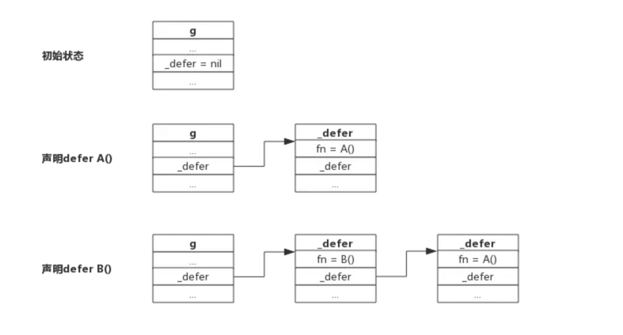

## 关于defer的理解

```json
defer用于资源的释放，会在函数返回之前进行调用：

defer的3个原则(将defer后的函数称为延迟函数)
```

```json
1.延迟函数的参数在defer语句出现时就已经确定下来了

func a() { 
  i := 0
  defer fmt.Println(i)
  i++
  return
}

defer语句中的fmt.Println()参数i值在defer出现时就已经确定下来，实际上是拷贝了一份。
后面对变量i的修改不会影响fmt.Println()函数的执行，仍然打印"0"。

注意：对于指针类型参数，规则仍然适用，只不过延迟函数的参数是一个地址值，
这种情况下，defer后面的语句对变量的修改可能会影响延迟函数。


```
```json
2.延迟函数执行按后进先出顺序执行，即先出现的defer最后执行

这个规则很好理解，定义defer类似于入栈操作，执行defer类似于出栈操作。

设计defer的初衷是简化函数返回时资源清理的动作，资源往往有依赖顺序，比如先申请A资源，再跟据A资源申请B资源，跟据B资源申请C资源，即申请顺序是:A-->B-->C，释放时往往又要反向进行。这就是把deffer设计成FIFO的原因。

每申请到一个用完需要释放的资源时，立即定义一个defer来释放资源是个很好的习惯。


```

```json
延迟函数可能操作主函数的具名返回值

定义defer的函数，即主函数可能有返回值，返回值有没有名字没有关系，defer所作用的函数，即延迟函数可能会影响到返回值。

若要理解延迟函数是如何影响主函数返回值的，只要明白函数是如何返回的就足够了
```

```json
匿名返回值：返回字面值，无法影响
func foo() int {    
  var i int
    defer func() {
        i++
    }()    
    return 1}

匿名返回值：返回变量，可能影响

unc foo() int {    
  var i int

  defer func() {
  i++
  }()    
return i
}
```
一个携程有多个defer,链表的形式
